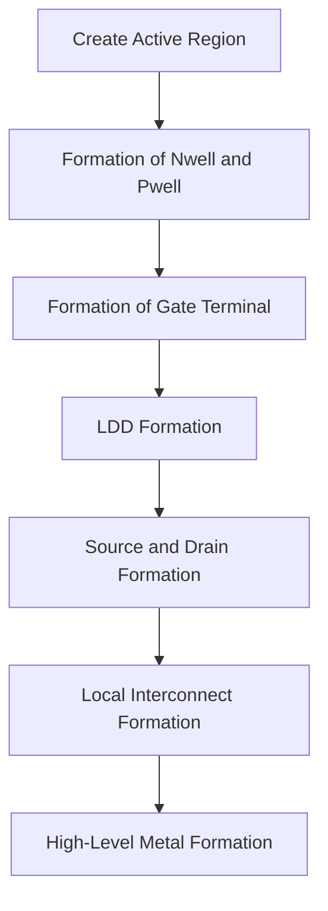

# NASSCOM-VSD-SoC Design and Planning workshop (Dec 11- Dec 24)

### About the workshop:
Welcome to the NASCOM SoC Design and Planning Workshop repository! This repository documents my journey through a two-week workshop focused on various aspects of System-on-Chip (SoC) design and planning, including hands-on experience with tools like OpenLane, Magic, and ngSpice.

## DAY 1 
Topics covered:
<details>
           
-  __Soc__(System on chip)

  A System on Chip (SoC) integrates all essential components of a computer or electronic system, such as the processor, memory, peripherals, and I/O, onto a single chip. This compact 
  design improves performance, power efficiency, and cost, making SoCs ideal for applications like smartphones, IoT devices, and embedded systems.


- __RISC-5__ (Reduced Instruction Set Computer)

  RISC-V is an open, free, and extensible Instruction Set Architecture (ISA) designed for flexibility and scalability, enabling use across a wide range of applications from 
  microcontrollers to supercomputers. Its open-source nature encourages innovation and eliminates licensing fees, making it popular in academia, industry, and open hardware projects.

- __RTL__ to __GDS-2__

  RTL to GDSII is the complete design flow that converts a high-level hardware description (RTL) into a manufacturable chip layout (GDSII format). This process includes synthesis, 
  floorplanning, placement, clock tree synthesis, routing, and verification to ensure the design meets functionality, timing, and manufacturing requirements.
  


- __what are PDK's ?__(Process Design Kits)

 A Process Design Kit (PDK) is a collection of files and data provided by a semiconductor foundry that describes the manufacturing process of a chip at a specific technology node (e.g., 
 130nm, 28nm). It includes information such as design rules, standard cell libraries, SPICE models, and technology files required for physical design, simulation, and verification.
 
-  __Google sky 130nm PDK__
  
  The SkyWater 130nm PDK is an open-source PDK developed by SkyWater Technology and released in collaboration with Google. It targets the 130nm technology node and provides resources for 
  chip designers to create silicon without proprietary restrictions, democratizing chip design by allowing free and open access to the design tools and libraries.
  
- __Role of Openlane in RTS to GDS 2__

  OpenLane is an open-source ASIC design flow that automates the conversion of RTL to GDSII, leveraging tools like Yosys for synthesis, OpenROAD for physical design, and Magic for layout 
  verification. It simplifies the design process by integrating all necessary tools and ensuring the design complies with the PDK's rules, making it an essential platform for open 
  hardware projects using PDKs like SkyWater 130nm.


- __EDA tools__

  
                    
</details>

OPENLANE DIRECTORY STRUCTURE : 
```
Desktop/work/tools/openlane_working_dir/openlane$
```
## Docker
<details>
Pre-configured Environment: OpenLane is distributed as a Docker image, meaning all required tools (e.g., tools for synthesis, placement, routing) and dependencies are pre-installed in a self-contained environment.
</details>

- initial setup commands to invoke __openlane__ :

```
cd ~/Desktop/work/tools/openlane_working_dir/openlane
docker
pwd
./flow.tcl -interactive
```
to check package version:
```
  package require openlane 0.9
```
to perform preparation
```
prep -design picorv32a
```


## Familirisation with openlane

### designs folder :
```
 Desktop/work/tools/openlane_working_dir/openlane/designs
```


### Picorv32a folder:

```
Desktop/work/tools/openlane_working_dir/openlane/designs/picorv32a
```


### Files created on Dec 12-12_14-35


### Synthesized file 
- to run synythesis
```
run_synyhesis
```
- Mapping info


- directory root for yosys stat report:
``` 
Desktop/work/tools/openlane_working_dir/openlane/designs/picorv32a/runs/12-12_17-12/reports/synthesis
```
- to open yosys stat report
```
less 1-yosys_4.stat.rpt
```


## Yosys stat report:
<details>
 The Yosys stat report in OpenLane summarizes the results of logic synthesis, including the total number of cells, their types (e.g., logic gates, flip-flops), and the estimated area utilization. It provides a breakdown of the cell distribution and key design statistics, such as wire counts and memory usage. This report helps designers analyze the design’s complexity and area requirements before proceeding to the physical design stages.          
</details>


```math
Flop\ Ratio = \frac{Number\ of\ D\ Flip\ Flops}{Total\ Number\ of\ Cells}
```
- By observing the __yosys stat report__ , it can be noticed that numner of D flip-flops are 1613 and Total number of cells in  the current created folder is 14876, hence flop ratio becomes
  
```math
Flop\ Ratio = \frac{1613}{14876}
```
 = 0.1084 or 10.84% 


## DAY 2

Topics covered:
<details>
           
- __Chip Floor-Planning consderations__

__Die__

The die is the entire physical piece of silicon that contains all the elements of the chip, including the core and peripheral components.

__Core__

The core of a chip refers to the part of the chip where the active components (such as processors, logic gates, memory cells, and transistors) are located.


__Utilization factor__

```math
Utilisation\ factor = \frac{ Area\ occupied\ by\ Netlist\ }{Total\ area\ of\ the\ core}
```
  
__Aspect ratio__

```math
Aspect\ ratio = \frac{Height\ \ of\ core\ }{Width\ of\ core}
```


- __Preplaced Cells__

In chip floor planning, preplaced cells refer to specific cells or components that are placed in fixed locations on the chip before the actual floor planning and layout design process begins. These cells typically serve important functions, such as power distribution, input/output (I/O) pads, or specialized areas that need to be placed in specific locations due to design or manufacturing constraints.


- __Decouplng Capacitors__

  Decoupling capacitors are capacitors placed between the power supply (Vcc) and ground (GND) to smooth out voltage fluctuations and filter noise from the power lines that could affect the performance of sensitive components in the circuit.
  
__How Do Decoupling Capacitors Work?__
When the power supply experiences a transient or voltage dip (such as when a component suddenly switches on), the decoupling capacitor charges to supply the required current.
Similarly, if there is a voltage spike, the capacitor discharges, absorbing the excess energy and preventing it from reaching the rest of the circuit.


- __Power-Planning__

Power planning in chip design refers to the process of designing and organizing the power distribution network within an integrated circuit (IC) or chip. This network ensures that all components on the chip receive the required voltage and current levels to function correctly, efficiently, and reliably.


 - __why do multiple VDD and VSS are used in Floor-planning?__

VDD and VSS are the primary power and ground connections for the entire chip. As chips grow in size and complexity, a single pair of VDD and VSS lines may not be sufficient to deliver power evenly to all parts of the chip.
Multiple VDD and VSS lines help distribute power efficiently across the chip, ensuring that all components have stable and reliable access to the voltage they require.


 - __Pin-Placement__

 Pin placement in chip floor planning refers to the process of determining where the input/output (I/O) pins of an integrated circuit (IC) will be located on the chip's 
 surface. These pins are the electrical contacts through which the chip interacts with the external environment, including other chips, devices, or the power supply.


__Logical cell placement blockage__


Types of Pin-Placement

<details>
           
__Periphery Pin Placement__

__Central Pin Placement__

__Corner Pin Placement__

__Clustered Pin Placement__

__Power and Ground Pin Placement__

__Symmetric Pin Placement__

</details>


- __Placement optimization__

Placement optimization in chip design refers to the process of improving the location of cells (standard cells, macros, or other components) on the chip to achieve specific design goals. These goals typically include maximizing performance, minimizing power consumption, reducing area, and ensuring proper functionality. The placement stage occurs after the logic synthesis and before the routing phase in the chip design flow.


- __Library__

A library in chip design, specifically in the context of digital IC design, contains a collection of pre-characterized cells that represent standard building blocks for creating circuits. These cells are used to design complex digital systems and include information about their functionality, electrical characteristics, timing behavior, and more.


-Based on the information of shapes and size of cells
-Based on the information of  Delay and STA


- __Library characterisation and Modelling__


</details>

## Cell design flow

Cell design flow refers to the series of steps or stages involved in the creation of a standard cell for an integrated circuit (IC). Standard cells are the fundamental building blocks used in digital ICs (such as logic gates, flip-flops, multiplexers, etc.), and the design of these cells involves a detailed process that ensures they meet the required performance, area, and power specifications.
<details>
Steps in the Cell Design Flow:
           
- __Specification and Architecture Definition:__

Functional Specification: Define the desired functionality of the cell (e.g., an AND gate, D flip-flop).
Performance Goals: Determine the target performance, including timing constraints (e.g., propagation delay, setup time, etc.), power consumption, and area requirements.
Power Consumption Requirements: Specify the maximum allowable power consumption and leakage currents.

-__Schematic Design:__

Create a schematic diagram of the cell that represents the logical connections between components (transistors, resistors, capacitors, etc.).
The schematic should accurately reflect the intended functionality of the cell.

-__Transistor Sizing:__
Choose appropriate sizes for the transistors in the cell based on the required electrical characteristics like drive strength, switching speed, and power consumption.
Aspect ratio (width to length) of transistors plays a key role in determining the cell's performance and area.

-__Layout Design:__

The schematic is translated into a physical layout, where the actual placement and routing of transistors and other components are defined.
The layout is optimized for the process node (e.g., 7nm, 14nm) and considers factors like density, congestion, and design rules for the fabrication process.

-__DRC (Design Rule Check):__

Perform a Design Rule Check (DRC) to ensure the layout complies with the manufacturing process’s geometrical constraints (minimum width, spacing, etc.). DRC ensures the design can be fabricated correctly and avoids physical errors like shorts or opens.

-__Extraction and Parasitic Modeling:__

- Extract the parasitic capacitances, resistances, and inductances from the layout.
Create parasitic models that are used to simulate the behavior of the cell under real-world conditions, accounting for the physical layout's impact on electrical performance.
Timing and Electrical Analysis:

- Perform timing analysis to determine the delay characteristics (e.g., propagation delay, rise/fall times) of the cell.
Ensure that the cell meets the required timing constraints (setup time, hold time, and clock skew).
Power analysis is also done to check for dynamic and static power consumption (including leakage).

-__SPICE Simulation:__

Simulate the cell's electrical behavior using SPICE (Simulation Program with Integrated Circuit Emphasis) to validate the performance, including delay, power, and noise characteristics.
Ensure the cell works correctly in a range of conditions (e.g., different supply voltages and temperatures).

-__Verification (Functional and Electrical):__

Perform functional verification to ensure that the cell operates as intended in all possible scenarios.
Conduct electrical verification to ensure the cell meets all the necessary electrical constraints, such as voltage levels, current limits, and power consumption.

-__Cell Characterization:__

Characterize the cell for timing and power, generating libraries of values that can be used in the design flow of higher-level circuit designs.
Characterization involves running simulations at different process, voltage, and temperature (PVT) corners and compiling delay, power, and noise data.

-__Library Generation:__

After characterization, generate a standard cell library that includes the electrical, timing, and physical data for each cell.
The library will contain models for various operating conditions and process corners, which are used during the Place and Route (P&R) stages of larger IC designs.

-__Post-Layout Simulation and Signoff:__

Perform post-layout simulations to verify the final layout works as expected with parasitic effects included.
Ensure the cell meets all design rules, timing requirements, and electrical constraints before the cell is signoff for production.

-__Tapeout:__

Once the cell passes all tests, the final design is sent for tapeout, which is the preparation of the final mask data for the manufacturing process.


</details>


- __Timing Characterisation__

Timing characterization is the process of determining the delay, setup, hold, and propagation times of a cell or circuit under various operating conditions (such as voltage, temperature, and process variations). It generates timing models that are used in larger chip designs for accurate performance analysis and optimization.


- Terms related to Timing Characterisation
<details>
           
__Slew_low_rise_thr:__
The voltage threshold used to determine the start of a rising edge when the signal is transitioning from a low voltage level.

__Slew_high_rise_thr:__
The voltage threshold used to determine the end of a rising edge when the signal is transitioning to a high voltage level.

__Slew_low_fall_thr:__
The voltage threshold used to determine the start of a falling edge when the signal is transitioning from a high voltage level.

__Slew_high_fall_thr:__
The voltage threshold used to determine the end of a falling edge when the signal is transitioning to a low voltage level.

__in_rise_thr:__
The voltage threshold used to determine the start of a rising edge at the input of a circuit.

__in_fall_thr:__ 
The voltage threshold used to determine the start of a falling edge at the input of a circuit.

__out_rise_thr:__
The voltage threshold used to determine the start of a rising edge at the output of a circuit.

__out_fall_thr:__
The voltage threshold used to determine the start of a falling edge at the output of a circuit.          


</details>

- __Die area__

```math
Length\  = \frac{660685 }{1000}

```
660.85u

```math
Width\  = \frac{671405 }{1000}

```
671.405u


__Characterising a cell__

 __Rise Transition__
 
It is the time taken to reach from 20% to 80% of the output rise waveform (logic 0 to 1).

```math
\text{Rise Transition} = \left( 20\% \text{ of the rise waveform} \right) - \left( 80\% \text{ of the rise waveform} \right)

```


__Fall Transition__

It is the time taken to reach from 80% to 20% of the output fall waveform (logic 1 to 0).

```math
\text{Rise Transition} = \left( 80\% \text{ of the fall waveform} \right) - \left( 20\% \text{ of the fall waveform} \right)

```

__Rise cell dealy__

It is the time difference  between 50% of input voltage and output voltage defined at the 50% of input voltage ,in the output rise waveform.

```math
\text{Rise cell delay} = \left( 50\% \text{ of the input voltage of rise waveform} \right) - \left( 50\% \text{ of the output voltage of rise waveform} \right)

```
__Fall cell delay__

It is the time difference  between 50% of input voltage and output voltage defined at the 50% of input voltage, in output fall waveform.

```math
\text{Rise cell delay} = \left( 50\% \text{ of the input voltage of fall waveform} \right) - \left( 50\% \text{ of the output voltage of fall waveform} \right)

```

### Procedure for Floor Planning

```
cd ~/Desktop/work/tools/openlane_working_dir/openlane
docker
pwd
./flow.tcl -interactive
prep -design picorv32a
run_synthesis
run_floorplan
```


- __README.md__
  

The __README.md__ file in OpenLane provides an overview of the project, describing it as an open-source, end-to-end ASIC design flow that integrates tools like Yosys, Magic, and KLayout. It includes instructions for installation, environment setup, and running designs, along with examples to help users get started. Additionally, it covers details about supported platforms, configuration options, contribution guidelines, and licensing.

To open __readme.md file__
  
```
cd ~/Desktop/work/tools/openlane_working_dir/openlane
cd configuration
ls -ltr
less readme.md

```
  
 
 
- Before running the floorpan the defaults configurations,  such as core utilization ,default input and output pin placements can be checked 
  inside the readme.md file

 Files created as dated on __15-12_2-07__

 

 to run floorplan: 

```
run_floorplan
```
- In OpenLane, run_floorplan defines the physical layout of the chip by setting the core area, placing IO pins and macros, creating standard cell rows, and adding power straps. It prepares the design for placement and routing in subsequent stages.
- Another important note is that in openlane  __standard cells__ are not placed in floorplan they are placed after the placement
  
  


__Def file__

In OpenLane, the __def.file (Design Exchange Format)__ is a critical file containing the physical layout information of an ASIC design. It includes:

<details>
           
__Design details:__ Name, units, and grid structure.

__Component placement:__ Locations of cells and macros.

__Connections:__ Netlists, pins, and routing guides.

__Special elements:__ Power/ground nets, obstructions, vias.

</details>

The DEF file is used at various stages of the flow, like placement, routing, and layout verification. It serves as both an input and an output for tools in the physical design process.
  

  to open def file for placement:

  ```
cd ~/Desktop/work/tools/openlane_working_dir/openlane/designs/picorv32a/runs/15_12-2_07/results/floorplan
less picorv32a.floorplan.def
  ```


Floorplan tech file location:

```
magic -T /home/nickson/Desktop/work/tools/openlane_working_dir/pdks/sky130A/libs.tech/magic/sky130A.tech lef read ../../tmp/merged.lef def read picorv32a.floorplan.def &

```


__Floorplan layout before the placement of standard cells__


In OpenLane, the run_placement step is responsible for placing the standard cells within the design area. Placement is a critical stage in the physical design flow where standard cells are positioned on the chip layout according to the logical netlist while considering design constraints and physical resources.

### Initial global placement ##

Initial Global Placement is the first step in the placement stage of the ASIC physical design flow. It aims to place standard cells within the chip's core area in an approximate manner to minimize wirelength and congestion while keeping the design scalable for further optimization and legalization.

Key Tasks of run_placement

to run placement:
```
run_placement
```
__Standard Cell Placement__:

The primary function is to place standard cells (small pre-designed logic units like AND, OR, flip-flops) in the specified rows and sites within the core area.
Ensures cells are aligned properly to the placement grid.

__Initial (Global) Placement:__

The cells are initially placed with the goal of minimizing wirelength and congestion.
Tools like RePLace (global placement) or OpenROAD's placement engine are used.

__Legalization:__

Adjusts the positions of the standard cells to ensure:
Cells do not overlap.
Placement adheres to row boundaries and design rules.
Cells align to the placement grid.

__Placement Optimization:__

The placement step optimizes the layout for:
Wirelength minimization.
Timing and congestion reduction.
It may also consider power/ground (P/G) grid constraints.


Def file for placement

tech file location:

```
magic -T /home/nickson/Desktop/work/tools/openlane_working_dir/pdks/sky130A/libs.tech/magic/sky130A.tech lef read ../../tmp/merged.lef def read picorv32a.placement.def &
  
```


__Magnified view of placement__


__tckon.tcl__


The tckon.tcl file in OpenLane is a TCL script responsible for enabling timing checks and configuration during the design flow. It typically sets up timing constraints, clock definitions, and required timing margins to ensure the design meets performance requirements. This script is executed during key stages like placement, CTS (Clock Tree Synthesis), and routing, enabling tools to analyze and optimize timing.


## DAY 3 

Topics covered:

<details>
           
__Spice simulation for CMOS inverter__

__Steps to git clone vsdstdcelldesign__

__CMOS fabrication process__

__Introduction Mgic tool options and DRC rules__

__Challenges to find incorrect and missing rules__
       
</details>

### SPICE DECK ###

A SPICE deck in OpenLane is a simulation file that describes the electrical characteristics and interconnections of the design at the transistor level, enabling the verification of timing, power, and functionality through simulation. It is a crucial part of ensuring that the final design performs correctly under real-world conditions.

steps to set the simulation parameters in spice deck
- Identify the nodes such as  __Drain ,Source ,Substrate__.
- Name the selected nodes such as __out ,in ,0__.
- Set the supply voltage such as  __VPULSE__, __VDD__.
  


### Variation in VTC a Inverter due to different ratios of \( W/L \) for NMOS and PMOS ###
### Effect of \( W/L \) Ratios on Inverter VTC

1. **Balance between NMOS and PMOS**: The \( W/L \) ratio for PMOS is typically **larger** than NMOS to compensate for the lower hole mobility in PMOS, ensuring balanced switching characteristics.

2. **VTC Symmetry**: When **NMOS and PMOS** have similar \( W/L \) ratios, the **VTC** is symmetric, with sharp transitions between logic 0 and 1, leading to ideal voltage levels.

3. **Improved Switching Speed**: A **larger \( W/L \) ratio for PMOS** allows the inverter to **pull up** the output faster, resulting in **faster switching** and sharper voltage transitions.

4. **Noise Margins**: Proper sizing of NMOS and PMOS provides **stronger noise margins**, making the inverter more resistant to noise and voltage fluctuations at the input.

5. **Degraded Performance with Poor Sizing**: If the PMOS \( W/L \) ratio is too **small** compared to NMOS, the inverter will have **slower rise times**, a **gradual VTC**, reduced noise margins, and slower switching performance.


### CMOS FABRICATION PROCESS 

### 16-Mask CMOS Fabrication Process

The **16-mask CMOS fabrication process** refers to the use of **16 photolithography masks** to fabricate an integrated circuit (IC) on a semiconductor wafer. The process includes multiple steps to create the various layers of the circuit, such as **transistor structures (NMOS, PMOS)**, **interconnects**, and **metal layers**.

#### 1. **Wafer Preparation**:
   - **Starting material**: The process begins with a **silicon wafer** (typically 200mm or 300mm), which is cleaned and prepared for the deposition of materials.
   - **Oxide Layer**: A thin layer of **silicon dioxide (SiO₂)** is grown on the wafer’s surface through **thermal oxidation**, acting as an insulating layer for the transistor gate.

#### 2. **Masking and Lithography**:
   - The primary technique used for patterning the wafer is **photolithography**, which employs **16 separate masks**. Each mask defines a different part of the IC, such as transistors, interconnections, and contact openings.

#### 3. **Key Mask Layers**:

           
   - **Mask 1-3: Well Formation and Isolation**:
     - **Mask 1**: Defines the region for **NMOS** and **PMOS** devices, involving ion implantation or diffusion to create **N-well** and **P-well** regions.
     - **Mask 2-3**: Defines **isolation structures** such as **field oxide** or **shallow trench isolation (STI)**.
   
   

   - **Mask 4-6: Gate Formation**:
     - **Mask 4**: Defines the **polysilicon gate** pattern for the transistors.
     - **Mask 5**: Defines **source/drain implant** for NMOS and PMOS transistors.
     - **Mask 6**: Defines the **oxide spacers** around gates to prevent shorting between source/drain regions.
    
    
   
   - **Mask 7-9: Source/Drain and Contacts**:
     - **Mask 7**: Defines the **source and drain regions** via ion implantation.
     - **Mask 8-9**: Defines **contact holes** to connect the transistor’s source, drain, and gate to the first metal layer.
    
    
       
   - **Mask 10-12: Metal Layers and Interconnects**:
     - **Mask 10-12**: Defines the **metal layers** (e.g., metal-1, metal-2, metal-3) for interconnects between various parts of the circuit.
     - These layers are typically made of **aluminum** or **copper** with vias to connect different layers of metal.
      
      

   - **Mask 13-15: Contact via Definition**:
     - These masks define additional **via openings** for inter-layer connectivity, allowing metal layers to connect to the underlying devices.
      
      

   - **Mask 16: Final Passivation Layer**:
     - **Mask 16**: Defines the **final passivation layer** (usually **silicon nitride** or **silicon dioxide**) that protects the IC from environmental damage and provides electrical isolation.
      
      


#### 4. **Key Steps in the Fabrication Process**:
   - **Oxidation**: Grow a thin layer of silicon dioxide on the wafer surface.
   - **Deposition**: Deposit materials like **polysilicon** and **metals** using **chemical vapor deposition (CVD)** or **physical vapor deposition (PVD)**.
   - **Photolithography**: Use photomasks to pattern the layers onto the wafer using photoresist, UV light, and development.
   - **Etching**: Remove unwanted materials through **dry etching** or **wet etching**.
   - **Ion Implantation**: Introduce dopants into specific wafer regions to create **NMOS** and **PMOS** regions.
   - **Chemical Mechanical Planarization (CMP)**: Polish the wafer surface to flatten it after deposition and etching.

#### 5. **Final Steps**:
   - **Wafer Testing**: Once fabrication is complete, the wafer undergoes testing to check for defects and verify that the transistors and interconnections are functioning as expected.
   - **Dicing and Packaging**: The wafer is cut into individual **dies**, which are then packaged into IC packages for integration into electronic devices.



